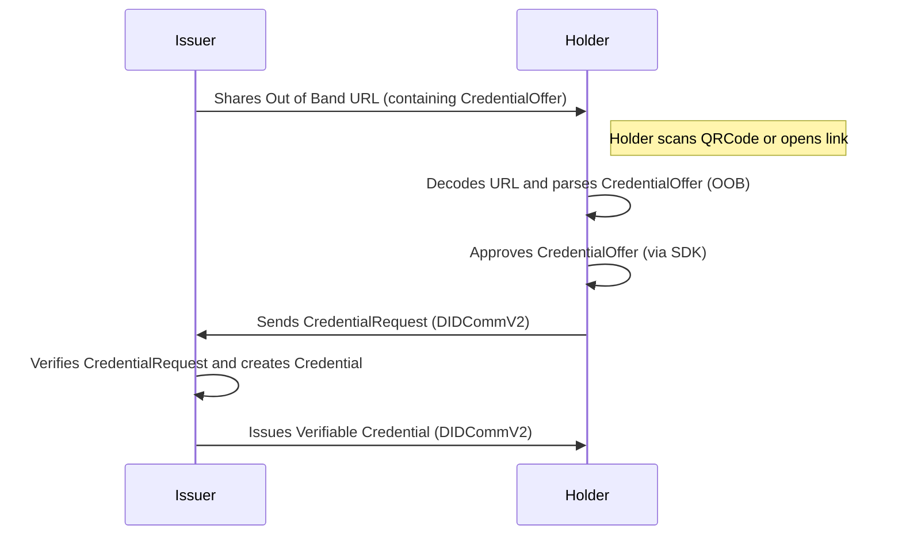

# Connectionless Credential Offer

## Description
A Connectionless Credential Offer is an Out of Band Invitation with a Credential Offer Attachment.
This should be a URI with a single query parameter `_oob`, which is an encoded JSON.
It should look similar to:

```
https://my.domain.com/path?_oob=eyJpZCI6ImY5NmUzNjk5LTU5MWMtNGFlNy1iNWU2LTZlZmU2ZDI2MjU1YiIsInR5cGUiOiJodHRwczovL2RpZGNvbW0ub3JnL291dC1vZi1iYW5kLzIuMC9pbnZpdGF0aW9uIiwiZnJvbSI6ImRpZDpwZWVyOjIuRXo2TFNmc0tNZTh2U1NXa1lkWkNwbjRZVmlQRVJmZEdBaGRMQUdIZ3gyTEdKd2ZtQS5WejZNa3B3MWtTYWJCTXprQTN2NTl0UUZuaDNGdGtLeTZ4TGhMeGQ5UzZCQW9hQmcyLlNleUowSWpvaVpHMGlMQ0p6SWpwN0luVnlhU0k2SW1oMGRIQTZMeTh4T1RJdU1UWTRMakV1TXpjNk9EQTRNQzlrYVdSamIyMXRJaXdpY2lJNlcxMHNJbUVpT2xzaVpHbGtZMjl0YlM5Mk1pSmRmWDAiLCJib2R5Ijp7ImdvYWxfY29kZSI6Imlzc3VlLXZjIiwiZ29hbCI6IlRlc3QgT09CIiwiYWNjZXB0IjpbImRpZGNvbW0vdjIiXX0sImNyZWF0ZWRfdGltZSI6MTcyNDg1MTEzOSwiZXhwaXJlc190aW1lIjo5OTI0ODUxNDM5LCJhdHRhY2htZW50cyI6W3siaWQiOiIwMGNkYzkwYy05YTk5LTRjZGEtODdmZS00ZjRiMjU5NTExMmEiLCJtZWRpYV90eXBlIjoiYXBwbGljYXRpb24vanNvbiIsImRhdGEiOnsianNvbiI6eyJpZCI6IjY1NWU5YTJjLTQ4ZWQtNDU5Yi1iM2RhLTZiMzY4NjY1NTU2NCIsInR5cGUiOiJodHRwczovL2RpZGNvbW0ub3JnL2lzc3VlLWNyZWRlbnRpYWwvMy4wL29mZmVyLWNyZWRlbnRpYWwiLCJib2R5Ijp7ImdvYWxfY29kZSI6Ik9mZmVyIENyZWRlbnRpYWwiLCJjcmVkZW50aWFsX3ByZXZpZXciOnsidHlwZSI6Imh0dHBzOi8vZGlkY29tbS5vcmcvaXNzdWUtY3JlZGVudGlhbC8zLjAvY3JlZGVudGlhbC1jcmVkZW50aWFsIiwiYm9keSI6eyJhdHRyaWJ1dGVzIjpbeyJuYW1lIjoiZmFtaWx5TmFtZSIsInZhbHVlIjoiV29uZGVybGFuZCJ9XX19fSwiYXR0YWNobWVudHMiOlt7ImlkIjoiODQwNDY3OGItOWEzNi00OTg5LWFmMWQtMGY0NDUzNDdlMGUzIiwibWVkaWFfdHlwZSI6ImFwcGxpY2F0aW9uL2pzb24iLCJkYXRhIjp7Impzb24iOnsib3B0aW9ucyI6eyJjaGFsbGVuZ2UiOiJhZDBmNDNhZC04NTM4LTQxZDQtOWNiOC0yMDk2N2JjNjg1YmMiLCJkb21haW4iOiJkb21haW4ifSwicHJlc2VudGF0aW9uX2RlZmluaXRpb24iOnsiaWQiOiI3NDhlZmE1OC0yYmNlLTQ0MGQtOTIxZi0yNTIwYTg0NDY2NjMiLCJpbnB1dF9kZXNjcmlwdG9ycyI6W10sImZvcm1hdCI6eyJqd3QiOnsiYWxnIjpbIkVTMjU2SyJdLCJwcm9vZl90eXBlIjpbXX19fX19LCJmb3JtYXQiOiJwcmlzbS9qd3QifV0sInRoaWQiOiJmOTZlMzY5OS01OTFjLTRhZTctYjVlNi02ZWZlNmQyNjI1NWIiLCJmcm9tIjoiZGlkOnBlZXI6Mi5FejZMU2ZzS01lOHZTU1drWWRaQ3BuNFlWaVBFUmZkR0FoZExBR0hneDJMR0p3Zm1BLlZ6Nk1rcHcxa1NhYkJNemtBM3Y1OXRRRm5oM0Z0a0t5NnhMaEx4ZDlTNkJBb2FCZzIuU2V5SjBJam9pWkcwaUxDSnpJanA3SW5WeWFTSTZJbWgwZEhBNkx5OHhPVEl1TVRZNExqRXVNemM2T0RBNE1DOWthV1JqYjIxdElpd2ljaUk2VzEwc0ltRWlPbHNpWkdsa1kyOXRiUzkyTWlKZGZYMCJ9fX1dfQ==
```

The Issuer creates a CredentialOffer and shares it with the Holder as an out-of-band URL. The Holder can then decode the `CredentialOffer` and use the SDK to either approve or reject it.

If the Holder accepts the offer, a `CredentialRequest` is sent to the Issuer. The Issuer then issues the final `Credential` to the Holder. All communications are performed using DIDComm v2.



## For Issuers

### Using the Cloud Agent
Creating a Credential Offer OOB Url through the Cloud Agent is pretty straight forward, do [POST request to /issue-credentials/credential-offers/invitation](/docs/agent-api/#tag/Issue-Credentials-Protocol/operation/createCredentialOfferInvitation):

```
curl --location 'http:///cloud-agent/issue-credentials/credential-offers/invitation' \
--header 'Content-Type: application/json' \
--data '.......'
```

A successful response will contain (string) invitation.invitationUrl.

### Using TS SDK
The SDK provides everything that is needed by issuers, creating and publishing prism:dids, resolving those onChain, creating OOB Credential Offers, OOB Presentation requests.

Add the required imports
```typescript
import SDK from "@hyperledger/identus-sdk";
```

Here's the types we are going to be using
```typescript
type Claims = {name: string, value: any}
type Request = {
    id: string;
    claims: Claims[];
    credentialFormat: string;
    automaticIssuance: boolean;
    issuingDID: string;
}
``` 

Let's create the function to create the OOB Credential Offer URL
```typescript

async function createCredentialOffer(agent: SDK.Agent, request: Request, baseUrl: string) {
    const peerDID = await agent.createNewPeerDID([], true)
    const oobTask = new SDK.Tasks.CreateOOBOffer({
        from: peerDID,
        offer: new SDK.OfferCredential(
            {
                goal_code: "Offer Credential",
                credential_preview: {
                    type: SDK.ProtocolType.DidcommCredentialPreview,
                    body: {  attributes: request.claims },
                },
            },
            [
                new SDK.Domain.AttachmentDescriptor(
                    {
                        json: {
                            id: crypto.randomUUID(),
                            media_type: "application/json",
                            options: { challenge: crypto.randomUUID(), domain: baseUrl },
                            thid: request.id,
                            presentation_definition: {
                                id: crypto.randomUUID(),
                                input_descriptors: [],
                                format: {
                                    jwt: { alg: [ SDK.Domain.JWT_ALG.EdDSA ], proof_type: [] },
                                },
                            },
                            format: request.credentialFormat,
                        },
                    },
                    "application/json",
                    request.id,
                    undefined,
                    request.credentialFormat
                )
            ],
            undefined,
            undefined,
            request.id
        )
    });
    const oob = await agent.runTask(oobTask);
    return `${baseUrl}/?oob=${oob}`;
}
```

Calling the function is pretty straight forward, you will need an instance of the Agent (```SDK.Agent```) and pass the required parameters, await for the response that will already be the string with the oob url.


## For Holders
Holders will scan the qrcode, and extract the CredentialOffer from the OutOfBandInvitation Message.

Parsing the OOB Url is very easy in the SDK:

```typescript
import SDK from "@hyperledger/identus-sdk";
async function parseOOB(agent: SDK.Agent, url: string): Promise<SDK.InvitationType> {
    return agent.parseInvitation(url)
}
```

We would then build the complete CredentialOffer message, holder at this point should accept or reject:
```typescript
import SDK from "@hyperledger/identus-sdk";
const oobMessage: SDK.OutOfBandInvitation = await parseOOB(agent, oobURL);
const selfPeerDID = await agent.createPeerDID([], true)
const oobOfferMessage:SDK.Domain.Message = SDK.Domain.Message.fromJSON({
    ...oobMessage.attachments.at(0)?.pasyload,
    from: oobMessage.from,
    to: selfPeerDID
})
```

Accepting the Offer using ```oobOfferMessage```, which will Create ```SDK.Domain.Message``` and send it back to the Issuer for its acceptance. (If automatic issuance was implemented then the Credential should come right after receiving the appropiate credential request)

```typescript
const requestCredential = await agent.handle(oobOfferMessage)
await agent.send(requestCredential.makeMessage());
```
