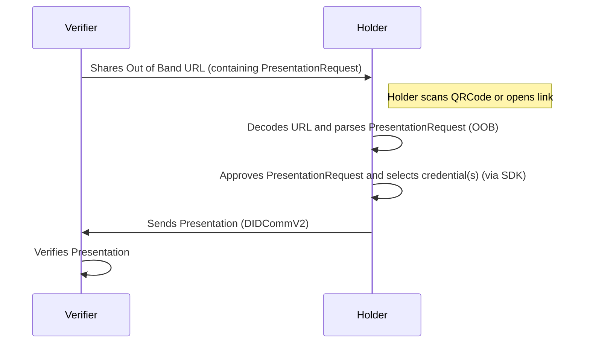

# Connectionless Presentation

## Description
A Connectionless PresentationRequest is an Out of Band Invitation with a PresentationRequest Attachment.
This should be a URI with a single query parameter `_oob`, which is an encoded JSON.
It should look similar to:

```
https://my.domain.com/path?_oob=eyJpZCI6IjcxYTE2ZGEzLTk3ZmYtNDYwYS1iNWY5LTI1YTYxZmU4NjRmNCIsInR5cGUiOiJodHRwczovL2RpZGNvbW0ub3JnL291dC1vZi1iYW5kLzIuMC9pbnZpdGF0aW9uIiwiZnJvbSI6ImRpZDpwZWVyOjIuRXo2TFN0MkMxeHZpQjduRkVVSEpBeVdxdkRGMnh5SnRRSFdhZlFNeG15MVN5U29INi5WejZNa2dNQ2hxWlZRNDdHODhFQlk2UVpvUGJCc0NxQnlodHlmQTNUUXB5QktuN0VqLlNleUowSWpvaVpHMGlMQ0p6SWpwN0luVnlhU0k2SW1oMGRIQTZMeTh4T1RJdU1UWTRMakV1TkRRNk9EQXdNQzlrYVdSamIyMXRJaXdpY2lJNlcxMHNJbUVpT2xzaVpHbGtZMjl0YlM5Mk1pSmRmWDAiLCJib2R5Ijp7ImdvYWxfY29kZSI6InByZXNlbnQtdnAiLCJnb2FsIjoiUmVxdWVzdCBwcm9vZiBvZiB2YWNjaW5hdGlvbiBpbmZvcm1hdGlvbiIsImFjY2VwdCI6W119LCJhdHRhY2htZW50cyI6W3siaWQiOiJjOGMxY2E3Zi05YjJjLTQwOGQtODZkMi0zNWJiYmU2ZTMwNjgiLCJtZWRpYV90eXBlIjoiYXBwbGljYXRpb24vanNvbiIsImRhdGEiOnsianNvbiI6eyJpZCI6Ijc4ZTc5NTFhLWZhOTYtNDg2Mi1hYmVkLWFmYTBhZWQyMzgzNCIsInR5cGUiOiJodHRwczovL2RpZGNvbW0uYXRhbGFwcmlzbS5pby9wcmVzZW50LXByb29mLzMuMC9yZXF1ZXN0LXByZXNlbnRhdGlvbiIsImJvZHkiOnsiZ29hbF9jb2RlIjoiUmVxdWVzdCBQcm9vZiBQcmVzZW50YXRpb24iLCJ3aWxsX2NvbmZpcm0iOmZhbHNlLCJwcm9vZl90eXBlcyI6W119LCJhdHRhY2htZW50cyI6W3siaWQiOiJiNWIzZjBjMC05NWQ2LTRkOTItOWQ0Ni1hNDVmYTdlMzVjYWEiLCJtZWRpYV90eXBlIjoiYXBwbGljYXRpb24vanNvbiIsImRhdGEiOnsianNvbiI6eyJvcHRpb25zIjp7ImNoYWxsZW5nZSI6IjExYzkxNDkzLTAxYjMtNGM0ZC1hYzM2LWIzMzZiYWI1YmRkZiIsImRvbWFpbiI6Imh0dHBzOi8vcHJpc20tdmVyaWZpZXIuY29tIn0sInByZXNlbnRhdGlvbl9kZWZpbml0aW9uIjp7ImlkIjoiZjNmNmQwYTAtYzdhNS00NjAzLWJkZjUtMjU1ZWJkZGU5ODdiIiwiaW5wdXRfZGVzY3JpcHRvcnMiOltdfX19LCJmb3JtYXQiOiJwcmlzbS9qd3QifV0sInRoaWQiOiI3MWExNmRhMy05N2ZmLTQ2MGEtYjVmOS0yNWE2MWZlODY0ZjQiLCJmcm9tIjoiZGlkOnBlZXI6Mi5FejZMU3QyQzF4dmlCN25GRVVISkF5V3F2REYyeHlKdFFIV2FmUU14bXkxU3lTb0g2LlZ6Nk1rZ01DaHFaVlE0N0c4OEVCWTZRWm9QYkJzQ3FCeWh0eWZBM1RRcHlCS243RWouU2V5SjBJam9pWkcwaUxDSnpJanA3SW5WeWFTSTZJbWgwZEhBNkx5OHhPVEl1TVRZNExqRXVORFE2T0RBd01DOWthV1JqYjIxdElpd2ljaUk2VzEwc0ltRWlPbHNpWkdsa1kyOXRiUzkyTWlKZGZYMCJ9fX1dLCJjcmVhdGVkX3RpbWUiOjE3MjQ0MjY1NjgsImV4cGlyZXNfdGltZSI6MTcyNDQyNjg2OH0=
```

The Verifier creates a PresentationRequest and shares it with the Holder as an out-of-band URL. The Holder can then decode the `PresentationRequest` and use the SDK to either approve or reject it.

If the Holder accepts the PresentationRequest, a credential `Presentation` is sent to the Verifier. The Verifier will then resolve the DIDs onChain and verify that the Presentation is valid. All communications are performed using DIDComm v2.



## For Issuers

### Using the Cloud Agent
Creating a Credential Offer OOB Url through the Cloud Agent is pretty straight forward, do [POST request to /present-proof/presentations/invitation](/docs/agent-api/#tag/Present-Proof/operation/createOOBRequestPresentationInvitation):

```
curl --location 'http:///cloud-agent/present-proof/presentations/invitation' \
--header 'Content-Type: application/json' \
--data '.......'
```

A successful response will contain (string) invitation.invitationUrl.

### Using TS SDK
The SDK provides everything that is needed by Verifiers, creating and publishing prism:dids, resolving those onChain, creating OOB Presentation requests...

Add the required imports
```typescript
import SDK from "@hyperledger/identus-sdk";
```

Here's the types we are going to be using
```typescript
async function createRequestPresentationMessage<T extends SDK.Domain.CredentialType>(
  agent: SDK.Agent,
  type: T,
  claims: SDK.Domain.PresentationClaims<T>,
  toDID?: SDK.Domain.DID,
): Promise<SDK.Domain.Message>  {
  if (!agent) {
    throw new Error("No agent found");
  }

  const peerDID = await createPeerDID();
  let task: SDK.Utils.Task<any>;

  const task = new SDK.Tasks.CreatePresentationRequest({ 
    type, 
    toDID: toDID ?? peerDID, 
    claims:claims
  })

  const requestPresentation = await agent.runTask<SDK.RequestPresentation>(task);
  const requestPresentationMessage = requestPresentation.makeMessage();
  if (!toDID) {
    delete (requestPresentationMessage as any).to;
  }
  return requestPresentationMessage;
}
``` 

That function will return a ```SDK.Domain.Message``` that we can easily send with ```agent.send(requestPresentationMessage)```


## For Holders
Holders will scan the qrcode, and extract the PresentationRequest from the OutOfBandInvitation Message.

Parsing the OOB Url is very easy in the SDK:

```typescript
import SDK from "@hyperledger/identus-sdk";
async function parseOOB(agent: SDK.Agent, url: string): Promise<SDK.InvitationType> {
    return agent.parseInvitation(url)
}
```

We would then build the complete Presentation message, holder at this point should have accepted or rejected already:
```typescript
import SDK from "@hyperledger/identus-sdk";
const selfPeerDID = await agent.createPeerDID([], true)
const oobMessage = await parseOOB(agent, oobURL);
const presentationRequestMessage = SDK.Domain.Message.fromJson(
  oobMessage.attachments.at(0)?.payload
)
const request = SDK.RequestPresentation.fromMessage(message);
const credential:SDK.Domain.Credential = //The credential tha the user accepted the PresentaionRequest with
const task = new SDK.Tasks.CreatePresentation({ request, credential })
const presentationMessage = await agent.runTask(task);
```

Once the user has accepted the PresentationRequest, it will choose one ```SDK.Domain.Credential``` and reply to the ```SDK.RequestPresentation``` Message with a ```SDK.Presentation``` Message.

```typescript
await agent.send(presentationMessage);
```
